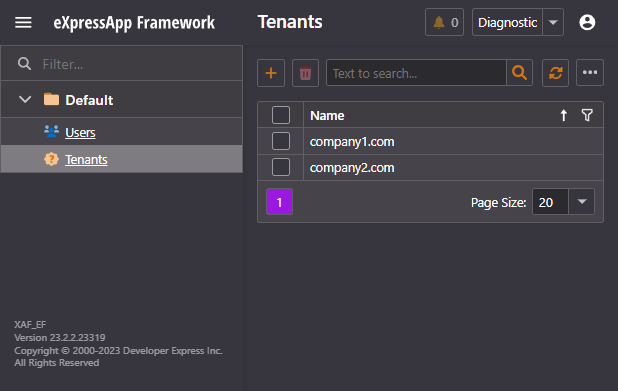
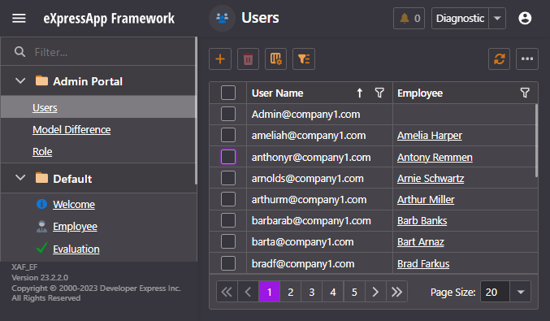

<!-- default badges list -->

[](https://supportcenter.devexpress.com/ticket/details/T1143380)
[](https://docs.devexpress.com/GeneralInformation/403183)
<!-- default badges end -->

# XAF - How to Create a Multi-Tenant Application

Our v23.2 major update marks the first official release of the DevExpress Multi-Tenancy Module. The first release supports straightforward CRUD usage scenarios and includes the following features:

 - XPO ORM support (v23.1 supported only EF Core).
 - Authentication: Log in with an email / OAuth2 account (like Microsoft Entra ID or Google), and a password (the domain automatically resolves the tenant and its storage).
 - Tenant Isolation: Multi-tenant app with multiple databases (a database per tenant).
 - Database Creation: The application automatically creates a tenant database and schema at runtime (if the database does not exist).

This example application is a modern multi-tenant iteration of our original WinForms-based Outlook-inspired demo solution. It serves as the central data management hub for the DevAv Company, overseeing various business entities such as Employees, Products, Orders, Quotes, Customers, and Stores.

For more information on multi-tenancy in XAF, refer to the [Multitenancy](https://docs.devexpress.com/eXpressAppFramework/404436/multitenancy) section of our online documentation.


## Table of Contents

- [Run the Application](#run-the-application) 
- [Implementation Details](#implementation-details) 
  - [Enable Multi-Tenancy](#enable-multi-tenancy)
  - [Configure ObjectSpaceProviders for tenants](#configure-objectspaceproviders-for-tenants)
  - [Fill the Databases with Initial Data](#fill-the-databases-with-initial-data)
- [Solution Overview](#solution-overview)
  - [Domain Diagram](#domain-diagram)
  - [Entity Framework Core](#entity-framework-core)
- [OutlookInspired.Win Project](#outlookinspiredwin-project)
  - [Controllers Folder](#controllers-folder)
  - [Editors Folder](#editors-folder)
  - [Services Folder](#services-folder)
  - [Features Folder](#features-folder)
    - [Maps Subfolder](#maps-subfolder)
    - [Customers Subfolder](#customers-subfolder)
    - [Employees Subfolder](#employees-subfolder)
    - [GridListEditor Subfolder](#gridlisteditor-subfolder)
    - [Products Subfolder](#products-subfolder)
    - [Quotes Subfolder](#quotes-subfolder)
- [OutlookInspired.Blazor.Server Project](#outlookinspiredblazorserver-project)
  - [Components Folder](#components-folder)
  - [Controllers Folder](#controllers-folder)
  - [Editors Folder](#editors-folder-1)
    - [Customers Subfolder](#customers-subfolder-1)
    - [Employees Subfolder](#employees-subfolder-1)
    - [Evaluations Subfolder](#evaluations-subfolder)
    - [Maps Subfolder](#maps-subfolder-1)
    - [Orders Subfolder](#orders-subfolder)
    - [Product Subfolder](#product-subfolder)

## Run the Application

When you launch the WinForms or Blazor application for the first time, you need to log in with the "Admin" account and a blank password. The application will run in Host User Interface mode used to view, create and edit Tenants. 



After you log in, two tenants are created in the system: *company1.com* and *company2.com*. You can view the tenant list in the Host User Interface's corresponding List View. 

After the Host Database is initialized, you can log in to Tenant User Interface using of the following Tenant Administrator accounts 

- *admin@company1.com* 
- *admin@company2.com* 

A Tenant Administrator has full access to all data stored in the Tenant Database but no access to other Tenants' data. Users and permissions are managed in each tenant independently.



Additionally, the example application creates a list of users with restricted access rights in each tenant, for example *klarkm@company1.com*, *clarkm@company2.com* and others.  

## Implementation Details 

### Enable Multi-Tenancy 

In the Blazor application, the following code enables multi-tenancy: 

- [OutlookInspired.Blazor.Server/Services/Internal/ApplicationBuilder.cs#L46C12-L46C12](https://github.com/EugeniyBurmistrov/How-to-create-a-multitenancy-application/blob/23.2.2%2B/CS/OutlookInspired.Blazor.Server/Services/Internal/ApplicationBuilder.cs#L46C12-L46C12) 

In the WinForms application, the following code enables multi-tenancy:

- [OutlookInspired.Win/Services/ApplicationBuilder.cs](https://github.com/EugeniyBurmistrov/How-to-create-a-multitenancy-application/blob/23.2.2%2B/CS/OutlookInspired.Win/Services/ApplicationBuilder.cs#L92) 

### Configure ObjectSpaceProviders for tenants

In the Blazor application: 

- [OutlookInspired.Blazor.Server/Services/Internal/ApplicationBuilder.cs](https://github.com/EugeniyBurmistrov/How-to-create-a-multitenancy-application/blob/23.2.2%2B/CS/OutlookInspired.Blazor.Server/Services/Internal/ApplicationBuilder.cs#L66)

In the WinForms application:

[OutlookInspired.Win/Services/ApplicationBuilder.cs#L80C12-L80C12](https://github.com/EugeniyBurmistrov/How-to-create-a-multitenancy-application/blob/23.2.2%2B/CS/OutlookInspired.Win/Services/ApplicationBuilder.cs#L80C12-L80C12)

 
### Fill the Databases with Initial Data 

A multi-tenant application works with several independent databases: 

- Host database – stores the list of Super Administrators and the list of tenants. 
- One or several tenant databases – store user data independently from other organizations (tenants).

A Tenant's database is created and populated with demo data on the first login to this tenant. 

The list of the tenants is created, and tenant databases are populated with demo data in the Module Updater: 

- [OutlookInspired.Module/DatabaseUpdate/Updater.cs#L13](https://github.com/EugeniyBurmistrov/How-to-create-a-multitenancy-application/blob/23.2.2%2B/CS/OutlookInspired.Module/DatabaseUpdate/Updater.cs#L13)

To be able to determine the tenant whose database is being updated when the Module Updater runs, the `Updater` class includes the `TenantId` and `TenantName` properties that return the current tenant's unique identifier and name respectively. 

- [OutlookInspired.Module/DatabaseUpdate/Updater.cs#L179](https://github.com/EugeniyBurmistrov/How-to-create-a-multitenancy-application/blob/23.2.2+/CS/OutlookInspired.Module/DatabaseUpdate/Updater.cs#L70)

When the Host Database is updated, the tenant is not specified, and the properties described above return `null`. 

## Solution Overview

### Domain Diagram

The diagram below depicts the application's architecture:


### Solution Structure

The solution consists of three distinct projects.


<a name="OutlookInspiredModule"></a>
- **OutlookInspired.Module** - A platform-agnostic module on which all other projects rely.
- **OutlookInspired.Blazor.Server** - A Blazor port of the original _OutlookInspired_ demo.
- **OutlookInspired.Win** - A WinForms port of the original _OutlookInspired_ demo.

#### `OutlookInspired.Module` project

##### `Services` Folder

This folder serves as the centralized storage for the application's business logic so that all other classes' implementation can be compact. For instance, methods that utilize `XafApplication` are located in _Services/XafApplicationExtensions_.

```cs
public static IObjectSpace NewObjectSpace(this XafApplication application) 
    => application.CreateObjectSpace(typeof(OutlookInspiredBaseObject));
```

Methods that use `IObjectSpace` can be found in _Services/ObjectSpaceExtensions_. For example:

```cs
public static TUser CurrentUser<TUser>(this IObjectSpace objectSpace) where TUser:ISecurityUser 
    => objectSpace.GetObjectByKey<TUser>(objectSpace.ServiceProvider.GetRequiredService<ISecurityStrategyBase>().UserId);
```
The `SecurityExtensions` class, configures a diverse set of permissions for each department. For instance, the Management department will have:

1. CRUD permissions for `EmployeeTypes`
2. Read-only permissions for `CustomerTypes`
3. Navigation permissions for `Employees`, `Evaluations`, and `Customers`
4. Mail merge permissions for orders and customers
5. Permissions for various reports including `Revenue`, `Contacts`, `TopSalesMan`, and `Locations`.

```cs
private static void AddManagementPermissions(this PermissionPolicyRole role) 
    => EmployeeTypes.AddCRUDAccess(role)
        .Concat(CustomerTypes.Prepend(typeof(ApplicationUser)).AddReadAccess(role)).To<string>()
        .Concat(new[]{ EmployeeListView,EvaluationListView,CustomerListView}.AddNavigationAccess(role))
        .Finally(() => {
            role.AddMailMergePermission(data => new[]{ MailMergeOrder, MailMergeOrderItem, ServiceExcellence }.Contains(data.Name));
            role.AddReportPermission(data => new[]{ RevenueReport, Contacts, LocationsReport, TopSalesPerson }.Contains(data.DisplayName));
        })
        .Enumerate();
```

##### `Attributes` Folder

The `Attributes` folder contains attribute declarations.

- `FontSizeDeltaAttribute`
  This attribute is applied to properties of `Customer`, `Employee`, `Evaluation`, `EmployeeTask`, `Order`, and `Product` types to configure the font size. The implementation is context-dependent; in the WinForms application, this attribute it is used by the `LabelPropertyEditor`...


  ```cs
   protected override object CreateControlCore() 
   => new LabelControl{
         BorderStyle = BorderStyles.NoBorder,
         AutoSizeMode = LabelAutoSizeMode.None,
         ShowLineShadow = false,
         Appearance ={
            FontSizeDelta = MemberInfo.FindAttribute<FontSizeDeltaAttribute>()?.Delta??0,
            TextOptions = { WordWrap =MemberInfo.Size==-1? WordWrap.Wrap:WordWrap.Default}
         }
   };
  ```

  ... and the `GridView`.

  ```cs
   public static void IncreaseFontSize(this GridView gridView, ITypeInfo typeInfo){
      var columns = typeInfo.AttributedMembers<FontSizeDeltaAttribute>().ToDictionary(
            attribute => gridView.Columns[attribute.memberInfo.BindingName].VisibleIndex,
            attribute => attribute.attribute.Delta);
      gridView.CustomDrawCell += (_, e) => {
            if (columns.TryGetValue(e.Column.VisibleIndex, out var column)) e.DrawCell( column);
      };
   }
  ```

  

  In the Blazor application, the logic that depends on the `FontSizeDeltaAttribute` is implemented in the following extension method:
  
  ```cs
    public static string FontSize(this IMemberInfo info){
        var fontSizeDeltaAttribute = info.FindAttribute<FontSizeDeltaAttribute>();
        return fontSizeDeltaAttribute != null ? $"font-size: {(fontSizeDeltaAttribute.Delta == 8 ? "1.8" : "1.2")}rem" : null;
    }
  ```

  The attribute is used similarly to the WinForms application:
  
  

- ##### `Appearance` Subfolder

  The following [Conditional Appearance module](https://docs.devexpress.com/eXpressAppFramework/113286/conditional-appearance) attributes are located here:

  `DeactivateActionAttribute`: This is an extension of the [Conditional Appearance module](https://docs.devexpress.com/eXpressAppFramework/113286/conditional-appearance) used to deactivate actions.

  ```cs
  public class DeactivateActionAttribute : AppearanceAttribute {
      public DeactivateActionAttribute(params string[] actions) : 
          base($"Deactivate {string.Join(" ", actions)}", DevExpress.  ExpressApp.ConditionalAppearance.AppearanceItemType.Action, "1=1")   {
          Visibility = ViewItemVisibility.Hide;
          TargetItems = string.Join(";", actions);
      }
  }
  
  ```

  Similarly, we derive from this attribute to create the other attributes found in the same folder (`ForbidCRUDAttribute`, `ForbidDeleteAttribute`,`ForbidDeleteAttribute`).

- ##### `Validation` Subfolder 
  In this folder, you can find attributes that extend the [XAF Validation module](https://docs.devexpress.com/eXpressAppFramework/113684/validation-module). Available are `EmailAddressAttribute`, `PhoneAttribute`, `UrlAttribute`, `ZipCodeAttribute`. The code sample illustrates how the `ZipCodeAttribute` is implemented. Other attributes are implemented similarly.

  ```cs
  public class ZipCodeAttribute : RuleRegularExpressionAttribute {
      public ZipCodeAttribute() : base(@"^[0-9][0-9][0-9][0-9][0-9]$") {
          CustomMessageTemplate = "Not a valid ZIP code.";
      }
  }
  ```

##### `Controllers` Folder
This folder contains controllers with no dependencies:

* The `HideToolBarController` - extends the XAF `IModelListView` interface with a `HideToolBar` attribute so we can hide the nested list view toolbar. 
* <a name="splitter"></a>The `SplitterPositionController` - extends the XAF model with a `RelativePosition` property used to configure the splitter position.

##### `Features` Folder
This folder contains implementations for features specific to the solution.

- ##### `CloneView` Subfolder

  This subfolder contains the `CloneViewAttribute` declaration, which is used to generate views in addition to the default ones. For example:
  
  ```cs
  [CloneView(CloneViewType.DetailView, LayoutViewDetailView)]
  [CloneView(CloneViewType.DetailView, ChildDetailView)]
  [CloneView(CloneViewType.DetailView, MapsDetailView)]
  [VisibleInReports(true)]
  [ForbidDelete()]
  public class Employee : OutlookInspiredBaseObject, IViewFilter,   IObjectSpaceLink, IResource, ITravelModeMapsMarker {
      public const string MapsDetailView = "Employee_DetailView_Maps";
      public const string ChildDetailView = "Employee_DetailView_Child";
      public const string LayoutViewDetailView =   "EmployeeLayoutView_DetailView";
  }
- ##### `Customers` Subfolder
  This subfolder contains controllers related to customers, such as:

  - ###### `MailMergeController`
    XAF offers built-in support for [mail merging](https://docs.devexpress.com/eXpressAppFramework/400006/document-management/office-module/mail-merge). This controller modifies the default `ShowInDocumentAction` icons.

      

  - ###### `ReportsController`
    This controller declares an action used to display Customer Reports. (The [XAF Reports module](https://docs.devexpress.com/eXpressAppFramework/113591/shape-export-print-data/reports/reports-v2-module-overview) API is used).

      

- ##### `Employees` Subfolder
  This subfolder contains controllers related to Employees, such as:

  - ###### `RoutePointController`
    This controller sets the travel distance calculated by the MAP service.

    WindowsForms:
    

    Blazor:
    

- ##### `Maps` Subfolder

  This subfolder houses logic related to mapping, including:

  <a name="mapsviewcontroller_"></a>
  - ###### `MapsViewController`

    This controller declares actions related to map features (`MapItAction`, `TravelModeAction`, `ExportMapAction`, `PrintPreviewMapAction`, `PrintAction`, `StageAction`, `SalesPeriodAction`) and manages their state based on the `ISalesMapMarker` and `IRoutePointMapMarker` interfaces.

- ##### `MasterDetail` Subfolder
  This subfolder houses a platform-agnostic master-detail feature implementation based on XAF's [DashboardViews](https://docs.devexpress.com/eXpressAppFramework/DevExpress.ExpressApp.DashboardView).

  - ###### `MasterDetailController, IUserControl`
    The `IUserControl` is implemented in a manner similar to the technique described in the following topic: [How to: Include a Custom UI Control That Is Not Integrated by Default (WinForms, ASP.NET WebForms, and ASP.NET Core Blazor)](https://docs.devexpress.com/eXpressAppFramework/113610/ui-construction/using-a-custom-control-that-is-not-integrated-by-default/using-a-custom-control-that-is-not-integrated-by-default). The distinction lies in the addition of the `UserControl` (for WinForms) and the Component (for Blazor) to a `DetailView`.

- ##### `Orders` Subfolder
  This subfolder focuses on functionality related to sales.

  - ###### `FollowUpController`
    Declares an action used to display the follow-up mail merge template for the selected order.
    
    

  - ###### `InvoiceController`
    Uses a master-detail mail merge template pair to generate an invoice, converts it to a PDF, and displays it using the `PdfViewEditor`.
  
  - ###### `Pay/Refund Controllers`
    These controllers declare actions to mark the selected order as either Paid or Refunded.
  
  - ###### `ReportController`
    Provides access to reports related to Order Revenue.

    

  - ###### `ShipmentDetailController`
    Adds a watermark to the Shipment Report based on the order status.

    
    

- ##### `Products` Subfolder
  This subfolder focuses on functionality related to Products.

  - ###### `ReportsController`
    Declares an action used to display reports for Sales, Shipments, Comparisons, and Top Sales Person.
  
    
  

- ##### `Quotes` Subfolder
  This subfolder focuses on functionality related to Products.

  - ###### `QuoteMapItemController`
    Calculates non-persistent `QuoteMapItem` objects used by the Opportunities view
  
    

- ##### `ViewFilter` Subfolder
  This subfolder contains a Filter manager implementation, which can be used by the end-user to create and save view filters.
  
  
  

#### OutlookInspired.Win project
This is the WinForms frontend project. It utilizes the previously mentioned `OutlookInspired.Module` and adheres to the same folder structure.

##### `Controllers` Folder
This folder contais the following controllers with no dependencies:   

- `DisableSkinsController` - This controller disables the XAF default theme-switching action. We strive for consistency in this demo across multiple platforms. Testing our views in each supported skin would require significant resources.

- **`SplitterPositionController`** - This is the WinForms implementation of the [SplitterPositionController](#splitter). We discussed its platform agnostic counterpart in the `OutlookInspired.Module` section.

##### `Editors` Folder
This folder contains custom controls and XAF [property editors](https://docs.devexpress.com/eXpressAppFramework/113097/ui-construction/view-items-and-property-editors/property-editors).

- `ColumnViewUserControl` - This is a base control that implements the [IUserControl](#masterdetailcontroller-iusercontrol) discussed previously.

- `EnumPropertyEditor` - This is a subclass of the built-in `EnumPropertyEditor`, with the difference that it displays only the image.
   
   

- `HyperLinkPropertyEditor` - This editor displays hyperlinks with mailto support.

   

- `LabelControlPropertyEditor` - This is an editor that renders a label.

  

- `PdfViewerEditor` - This is a PDF viewer using based on the [DevExpress PDF Viewer](https://docs.devexpress.com/WindowsForms/15216/controls-and-libraries/pdf-viewer) component.

  

- `PrintLayoutRichTextEditor` - This editor extends the built-in `RichTextPropertyEditor`, but uses the `PrintLayout` mode.

- `ProgressPropertyEditor` - This editor is used to display progress in various contexts.

  

##### `Services` Folder

Similarly to the platform-agnostic modules [Services Folder](#services-folder), the WinForms project keeps all classes as thin as possible and implements business logic in extension methods.

##### `Features` Folder

This folder contains custom functionality specific to the solution.

- ##### `Maps` Subfolder

  This subfolder houses logic related to mapping.

  - **MapsViewController** - This controller overrides the platform-agnostic `MapsViewController` to further configure the state of map actions.
  
  - **WinMapsViewController** - This is an abstract controller that provides functionality used by its derived classes - `SalesMapsViewController` and `RouteMapsViewController`. The controller configures Map views for all objects that implement the `ISalesMapsMarker` (Customer, Product) and `IRouteMapsMarker` (Order, Employee) interfaces.
  
  
  
  

- ##### `Customers` Subfolder

  This subfolder contains functionality related to customers.

  - **CustomerGridView**, **CustomerLayoutView**, and **CustomerStoreView**: These classes derive from the previously discussed `ColumnViewUserControl`. They host custom `GridControl` variants, such as master-detail layouts.
  
  

- ##### `Employees` Subfolder

  This subfolder contains functionality related to employees.

  - **EmployeesLayoutView** - This is a descendant of `ColumnViewUserControl` that hosts a GridControl LayoutView.

  

- ##### `GridListEditor` Subfolder

  This subfolder contains functionality related to default XAF GridListEditor.

  - `FontSizeController` - Uses the `FontSizeDelta` discussed in the platfrom-agnostic module section to increase the font size in a row cell of an AdvancedBanded Grid

  - `NewItemRowHandlingModeController` - Modifies how new object are handled when a dashboard master detail view (discussed in the platform-agnostic module section) objects are created.

- ##### `Products` Subfolder

  This subfolder contains functionality related to products.
  
  - `ProductCardView` - This is a descendant of `ColumnViewUserControl` that hosts a GridControl LayoutView.

    

- ##### `Quotes` Subfolder

  This subfolder contains functionality related to opportunities.

  - `WinMapsController`, `PaletteEntriesController` - Configures the opportunities maps view.

      

  - `FunnelFilterController` - Filters the Funnel chart when the FilterManager discussed in the platform-agnostic module section is executed.
  - `PropertyEditorController` - Assigns progress to the Pivot cell.

    

    
## OutlookInspired.Blazor.Server Project
This is the Blazor frontend project. It utilizes the previously mentioned `OutlookInspired.Module` and adheres to the same folder structure.

### `Components` Folder
This folder contains Blazor components essential for meeting the project's requirements.

- **ComponentBase, ComponentModelBase** - `ComponentBase` is the foundational component for client-side components like DxMap, DxFunnel, DXPivot, and PdfViewer. It manages loading of resources such as JavaScript files. `ComponentModelBase` acts as the base model for all components, offering functionalities like a `ClientReady` event and a hook for browser console messages, among other features.

  

- **HyperLink, Label** - These components function similarly to their WindowsForms counterparts and are used to render hyperlinks and labels.

  

- **PdfViewer** - This is a `ComponentBase` descendant that serves as a viewer for PDF files.

  

- **XafImg, BOImage** - Both components are used to display images in a variety of contexts.

  
  

- **XafChart** - This component is utilized for charting Customer stores.

  

- ##### `CardView` Subfolder
  
  This folder contains the the `SideBySideCardView` and the `StackedCardView`. They are used to display Card like listviews like bellow.

  

- ##### `DevExtreme` Subfolder

  In this folder we have .NET reusabe compoenents that utilizing the [Map](https://js.devexpress.com/jQuery/Demos/WidgetsGallery/Demo/Map/Markers/Light/), [VectorMap](https://js.devexpress.com/jQuery/Demos/WidgetsGallery/Demo/VectorMap/Overview/Light/), [Funnel](https://js.devexpress.com/jQuery/Demos/WidgetsGallery/Demo/Charts/FunnelChart/Light/) and [Chart](https://js.devexpress.com/jQuery/Demos/WidgetsGallery/Demo/Charts/Overview/Light/) DevExtreme Widgets.


### `Controllers` Folder
This folder contais the following controllers with no dependencies:   

- `CellDisplayTemplateController` - Is an abstract controller that allows the application to render the GridListEditor row cell fragments.
- `DxGridListEditorController` - Overiddes GridListEditor behaviours such as removing command columns.
- `PopupWindowSizeController` - Configures the size of popup windows.

### `Editors` Folder
This folder houses XAF custom editors. Examples include:

- **ChartListEditor** - An abstract list editor designed to aid in creating simple object-specific variants.
  
  ```csharp
  [ListEditor(typeof(MapItem), true)]
  public class MapItemChartListEditor : ChartListEditor<MapItem, string, decimal, string, XafChart<MapItem, string, decimal, string>> {
      public MapItemChartListEditor(IModelListView info) : base(info) {
      }
  }

- `ComponentPropertyEditor` - An abstract property editor that can serve as a base for editors such as `ProgressPropertyEditor` or `PdfViewEditor`. The latter makes use of the PdfViewer component from the _Components_ folder.

  ```cs
  [PropertyEditor(typeof(byte[]), EditorAliases.PdfViewerEditor)]
  public class PdfViewerEditor : ComponentPropertyEditor<PdfModel, PdfModelAdapter, byte[]> {
      public PdfViewerEditor(Type objectType, IModelMemberViewItem model) : base(objectType, model) {
      }
  }

  ```
- `EnumPropertyEditor` - Inherits from XAF's native EnumPropertyEditor, but solely displays the image, akin to its WinForms counterpart.

- `DisplayTestPropertyEditors` - Displays raw text, similar to the WinForms LabelPropertyEditor.

### `Features` Folder

This folder contains functionality specific to the solution.

- ##### `Customers` subfolder
  Uses components from the `Components` (bound to data) to render data related to customers. For example it uses the `StackedCardView` with a `StackedInfoCard` as shown below:

  ```cs
  <StackedCardView>
    <Content>
        @foreach (var store in ComponentModel.Stores){
            <StackedInfoCard Body="@store.City" Image="@store.Crest.LargeImage.ToBase64Image()"/>
        }
    </Content>
 </StackedCardView>
  ```

  The visual output is as follows:

  

  
- ##### `Employees` subfolder
  
  Uses components from the `Components` (bound to data) to render data related to employees.

  ```cs
  <StackedCardView >
    <Content>
        @foreach (var employee in ComponentModel.Objects){
            <SideBySideInfoCard CurrentObject="employee" ComponentModel="@ComponentModel" Image="@employee.Picture?.Data?.ToBase64Image()" HeaderText="@employee.FullName" 
                                InfoItems="@(new Dictionary<string, string>{{ "ADDRESS", employee.Address },
                                               { "EMAIL", $"<a href=\"mailto:{employee.Email}\">{employee.Email}</a>" },{ "PHONE", employee.HomePhone } })"/>
        }
    </Content>
</StackedCardView>
  ```

  The image below illustrates the result.

  

  The `Evaluations` and `Tasks` subfolders include components responsible for rendering the cell fragment in the image below. Both components are linked to the cell through the `Controllers\CellDisplayTemplateController`.

  

- ##### `Evaluations` subfolder
  The `SchedulerGroupTypeController` is required to set up the scheduler, as shown below:

  

- ##### `Maps` subfolder
  Mirroring its WinForms counterpart, this subfolder houses both the `RouteMapsViewController` and the `SalesMapsViewController`. These controllers are required to configure the maps (`ModalDxMap` and `ModalDxVectorMap`) along with their associated actions such as `TravelMode`, `SalesPeriod`, `Print`, and more. The components within this directory are fragments that employ components found in `Components/DevExtreme`. Additionally, they adjust their height as they are displayed in a modal popup window.
 
- ##### `Orders` subfolder
  The `DetailRow` component renders the detail fragment for the OrderListView.

  

- ##### `Product` subfolder
  Similar to the Employees subfolder, the `Component/CardViews/StackedCardView` declaration is as follows:

  ```xml
  <StackedCardView>
    <Content>
        @foreach (var product in ComponentModel.Objects) {
             <SideBySideInfoCard CurrentObject="product" ComponentModel="@ComponentModel" Image="@product.PrimaryImage.Data.ToBase64Image()" HeaderText="@product.Name" 
                                 InfoItems="@(new Dictionary<string, string>{{ "COST", product.Cost.ToString("C") },
                                                { "SALE PRICE", product.SalePrice.ToString("C") } })"
                                 FooterText="@product.Description.ToDocument(server => server.Text)"/>
         }

    </Content>
  </StackedCardView>
  ```

  The image below demonstrates the result:

  


Please take a moment to [complete a short survey](https://www.devexpress.com/products/net/application_framework/survey.xml) about your multi-tenancy requirements.

[Documentation](https://docs.devexpress.com/eXpressAppFramework/404436/multitenancy-support?v=23.2) | [Getting Started](https://docs.devexpress.com/eXpressAppFramework/404669/multitenancy/create-new-multitenant-application?v=23.2) | [Best Practices and Limitations](https://docs.devexpress.com/eXpressAppFramework/404436/multitenancy?v=23.2#best-practices-and-limitations)  | [Modules in a Multi-Tenant Application](https://docs.devexpress.com/eXpressAppFramework/404695/multitenancy/modules-in-multitenant-application?v=23.2)

